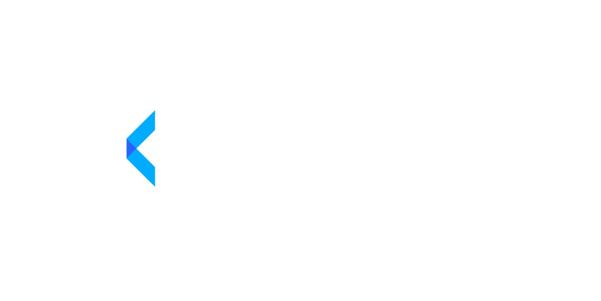

<h2 align="center" >Get a little bit richer every day.</h2>

Financeful is a personal finance web application that provides people with a better way to track and manage their money. It's an alternative to spreadsheets or traditional apps like Quicken, Mint and YNAB that can be complicated and overwhelming for new users. 

## Run locally:

To run this project locally you need to have a few things installed.

### PostgreSQL

##### Install PostgreSQL:

- macOS: Run brew install postgresql.
- Windows: Follow [this](https://www.postgresqltutorial.com/install-postgresql/) guide.
- Linux: Follow [this](https://www.postgresqltutorial.com/install-postgresql-linux/) guide.

##### Start PostgreSQL:

- macOS: Run brew services start postgresql.
- Windows: Start PostgreSQL through the control panel or run net start postgresql-{version}.
- Linux: Run /etc/rc.d/init.d/postgresql start.

##### Create a DB named financeful:

`$ psql postgres`

`$ CREATE DATABASE financeful`

### Install Dependencies

Navigate to both /server and /web and install dependencies using `YARN` and run `yarn dev`. This will start the development servers.

```
$ cd server
$ yarn install
```

```
$ cd web
$ yarn install
```

### Run the dev servers
To run the dev servers, cd into both the /server and /web directories and run ```yarn dev```;

Ex: 

Server:
```
$ cd *your-path-to-financeful*/server
$ yarn dev
```

Client:
```
$ cd *your-path-to-financeful*/web
$ yarn dev
```


### Interact with the DB and GraphQL Schema

Once the development server is running, you can view the GraphQL schema at

`http://localhost:4000/graphql`

If you want to view the contents of the DB in a GUI, open a new shell window and run these commands:

```
$ cd *your-path-to-financeful*/server
$ yarn studio
```

If for some reason the `yarn studio` throws an error, try running `npx prisma studio`.


### v1 Minimum Requirements:
##### Transactions 
   - [X] CRUD
   - [ ] Import CSV

##### Accounts:
  - [X] CRUD
  - [X] Account Overview
  - [X] Account Details Page

##### Dashboard:
 - [ ] Networth Chart
 - [ ] Recent Transactions
 - [ ] Upcoming Bills/Reminders
